<h1 style="color: #16385E;">cPast - An Android App for Historians in the Archive</h1>


This repository contains the Android app cPast.
It provides an .apk for download and use as well as the Java code base.

cPast helps you capture and organise your archive photos.
The app is aimed at all historians and researchers who work in historical archives.

<br>

<div align="center">
    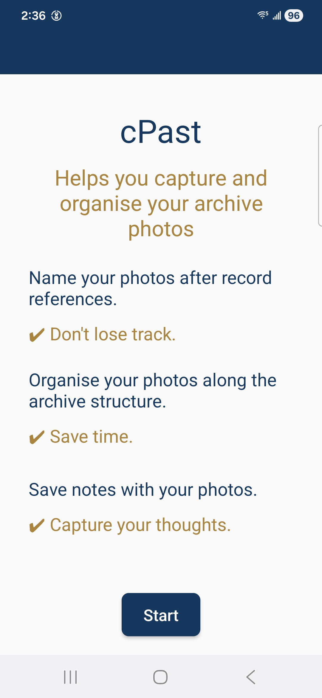
    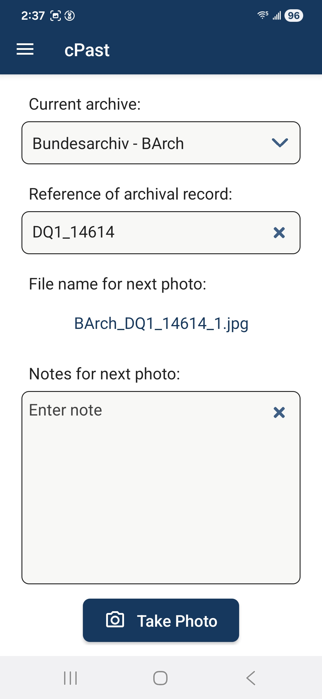
    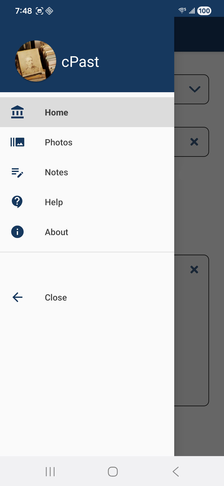
</div>

<h2 style="color: #16385E;">1) What does cPast do for me?</h2>

While you take photos in the archive, the app offers three core functions:

1) cPast <b style="color: #A8843E;">names your photos</b> according to this pattern:
    <div style="text-align: center; background-color: #f0f0f0; padding: 10px; border-radius: 10px; display: block;">
    Archive_Inventory_Record_Counter.jpg
    </div>
    <br>
   The app detects how many photos have already been taken for a record, uses this counter for the file name and automatically counts up when you take photos.
   Never lose track on a long day in the archive.
    <br>
    <br>
2) cPast automatically <b style="color: #A8843E;">creates folders</b> along the archive structure and saves your photos in them.
   <br>
   <br>E.g. for the record "DQ1/14614" in the German Federal Archive (short "BArch"):
   <div align="center">
      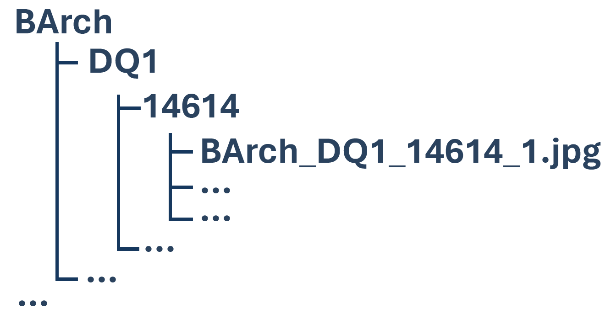
   </div>
   <br>
   Connect your mobile phone to your computer and move the top folder to your computer. Save time sorting your photos!
   <br>
   <br>
   
3) cPast allows you to <b style="color: #A8843E;">save notes about your photos</b>.
    Have you found an important document or had a brilliant idea that you want to think about later?
    Your notes are saved in a table with the recording time, archive and file name.
    This allows you to continue working on them later on your computer.
<div align="center">
   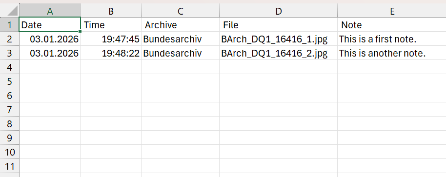
</div>

<h2 style="color: #16385E;">2) How can I install the app?</h2>

1) Click on the latest release in the Releases section at the right of this repository below the About section.
2) Download the .apk file. You do not need to download the source code.
3) Connect your phone to your computer using a USB cable.
4) Make sure to enable "Transferring files" in our phone's USB settings. Only now you can access the internal storage of your phone via your computer.
5) In your phone's settings search for the option "Install unknown apps". Enable installations from the source "My Files".
6) Access your phone's internal storage from your computer. To do so, you must select your phone in your file explorer and double click on it.
7) Navigate to your phone's "Download" folder via your file explorer on your computer.
8) Copy the .apk file from your computer to your phone.
9) On your phone open "My Files" > "Download" and click on the .apk file.
10) You will be asked "Do you want to install this app?" Click "Install".
11) You may be asked to scan the app. You can choose to scan the app and proceed with the installation.
12) Choose "Open" to start using cPast on your phone. You can disconnect your phone from your computer.

<h2 style="color: #16385E;">3) How can I use the app?</h2>

We will explore what you can do with cPast using the example of a stay at the German Federal Archive (Bundesarchiv / BArch) with a Galaxy S22 Android phone.

### Add and select an archive

Once we arrive at the archive, we add it to our lists of archives.
Open the drop down menu on the home screen, click on "Add Archive" and enter the archive name as well as the short form.
Enter the short form you would use to cite the archive.
This short form will automatically be part of the file name and the folder structure.
You made a typo? Use the pen symbol to open an edit dialog, where you can edit the names or delete the archive.
We enter "Bundesarchiv" and the short form "BArch".

<div align="center">
    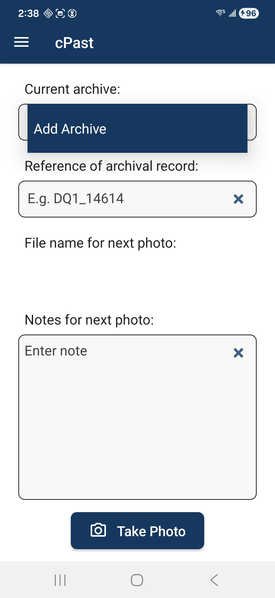
    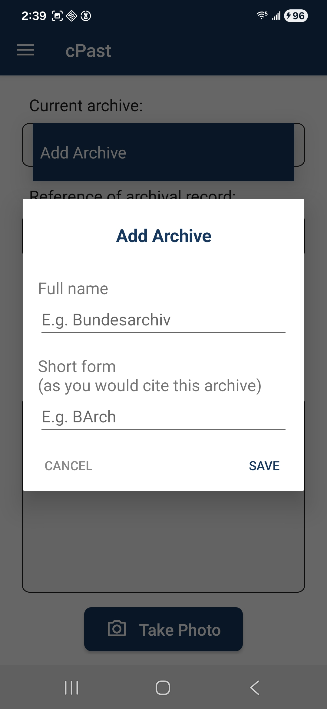
    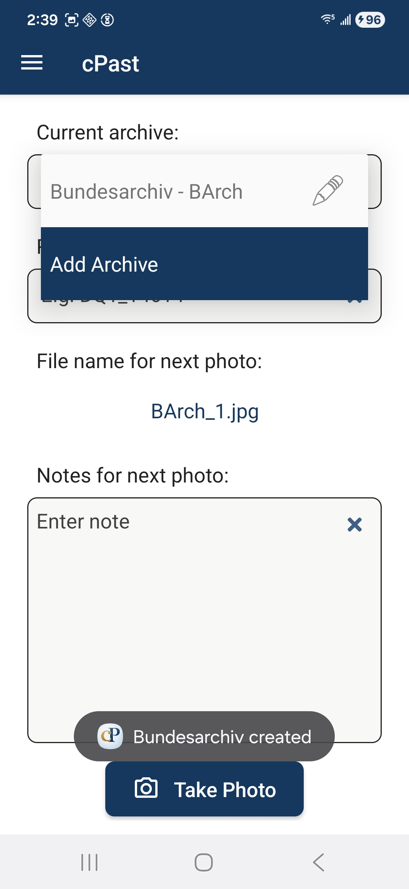
    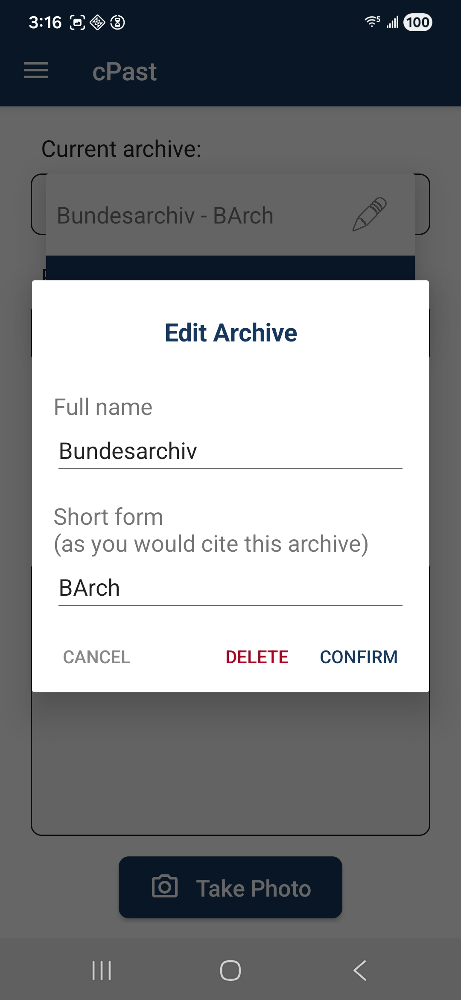
</div>

### Add record information and define folder structure via record name

We found an interesting record. The record reference provided by the archive is "DQ1/14614".
This includes two hierarchy levels (inventory and record name). We enter both separated with an underscore: "DQ1_14614".
Both "_" and "/" are valid options here. Your reference has more hierarchy levels? Simply add them with another underscore or slash.

We now see on our home screen that the file name for our next photo is a combination of the short archive name, the record reference and a counter.
The underscores define the folder structure provided by the app.
As we can see on the right, we will get nested folders that imitate the archive structure with our photos placed on the file level.
For more information on the use of the folder structure, please see below.

<div align="center">
    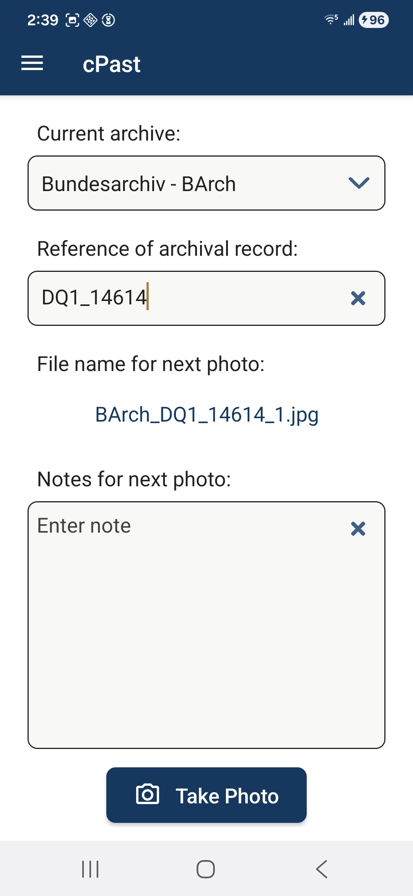
    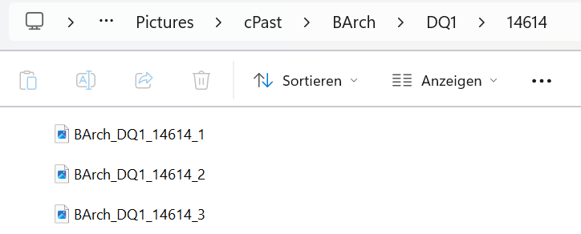
</div>

### Take notes and photos

We now want to start taking photos. As we take photos, starting from the "Take Photo" button, the counter in our file name increases.
We found a page that would make a great figure in our next publication. To find this photo later, we add a note in the note field before we take a photo of this page.
Once we confirmed the photo in the camera app of our phone, we receive a confirmation that both photo and note were saved.
To find an overview of your photos or notes, open the menu via the burger icon on the upper left.
"Photos" will open your gallery app. In "Notes" you see a list of the most recently captures photos with the notes you took.
Currently, your notes cannot be edited here. However, you can use and edit your notes on your computer.

Please note: This app does not save any of your photos or notes to a cloud or server. It runs only locally on your phone. This might be important for GDPR compliance.

<div align="center">
    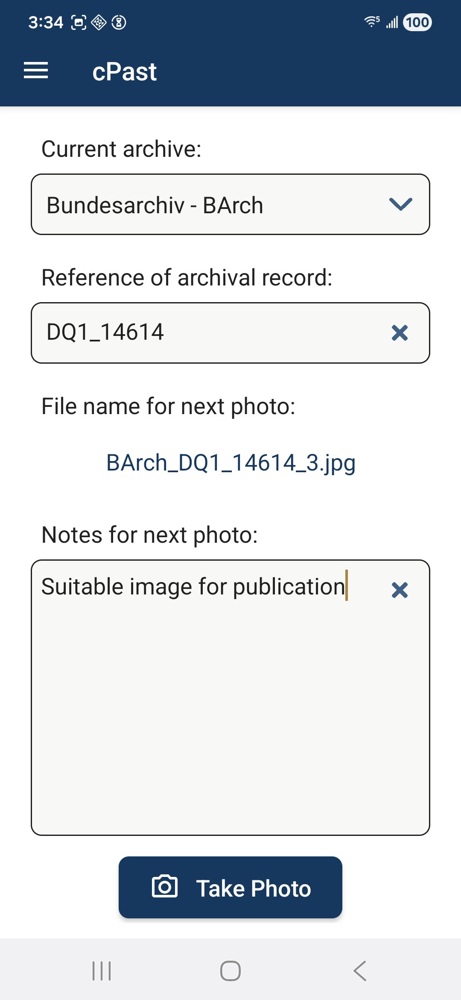
    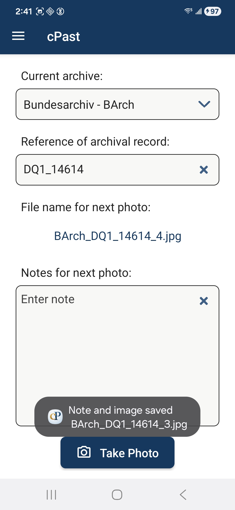
    
    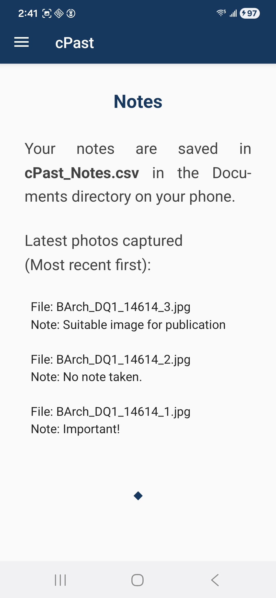
</div>

### Use your notes and photos on your computer

Our day in the archive is over and we want to transfer our material to our computer. We plug in our phone via cable.
To see the data on our phone via our computer, we must make sure to enable "Transferring files" in our phone's USB settings.
Then we can enter the internal storage via the file explorer on the computer. We will need the two folders "Pictures" and "Documents".

<div align="center">
    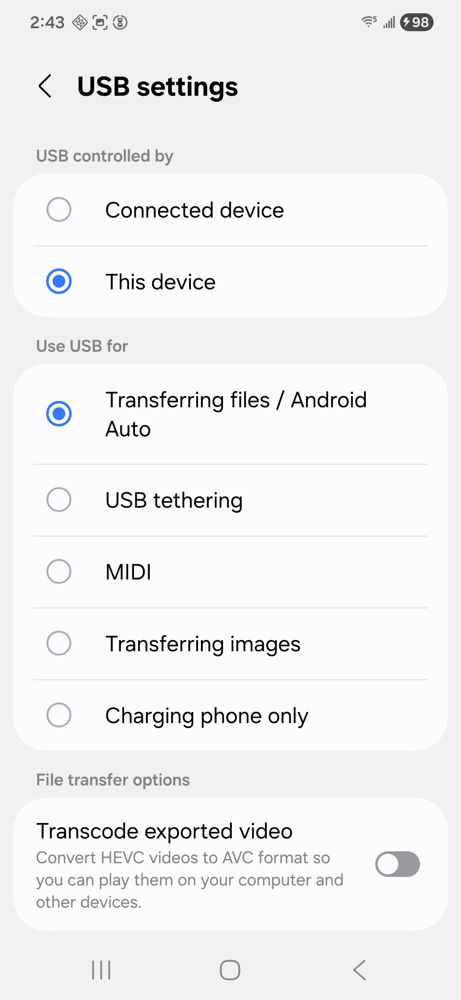
    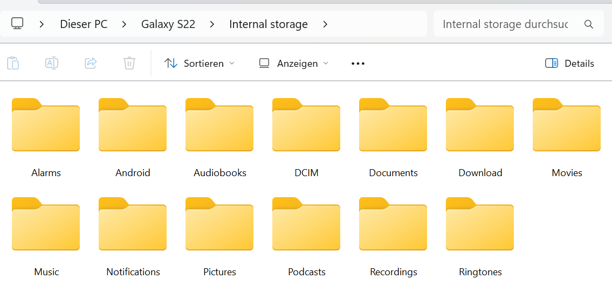
</div>

To find our photos, we navigate via Pictures to the cPast folder.
Here we find the "BArch" folder with the nested folder structure for all records we took photos of.
We can simply drag and drop this folder to our computer to save the photos.
It is not a problem to remove the folder from your phone.
If you continue to work in the same archive the next day, the app will build the folder structure again.
If you leave the folder structure the way it is, new files will be added at the right place within this structure.

<div align="center">
    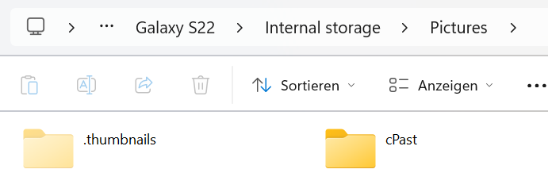
    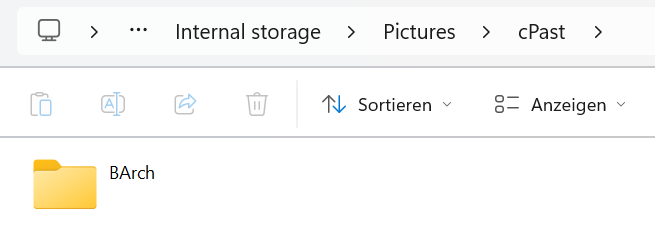
    
</div>

To find our notes, we will navigate via Documents to another cPast folder.
Here we find the file "cPast_Notes.csv". You can open it in an editor or spreadsheet programme, such as Excel.
You can move this file to your computer and remove it from your phone. This way, a new notes file will be created when you use the app the next time.
If you only copy the file to your computer and leave the file on your phone, new entries will be written to the same file.

<div align="center">
    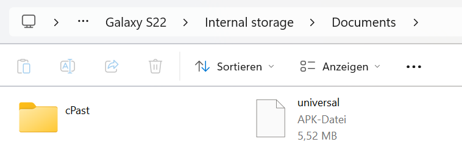
    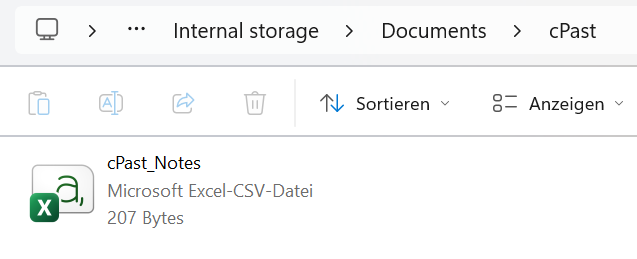
    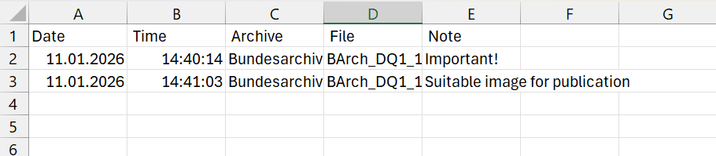
</div>

<h2 style="color: #16385E;">4) How is this app implemented?</h2>

### Architecture overview

This Java-based Android app follows clean architecture principles, ensuring separation of concerns and maintainability. The architecture consists of three layers:

- UI Layer: Handles user interactions (Activities, Fragments, ViewModels).

- Domain Layer: Contains business logic, use cases, and models (e.g., UseCases, Models, Repository Interfaces).

- Data Layer: Manages data sources and repositories.
```
/app
├── /ui (Activities, Fragments, ViewModels)
├── /domain (UseCases, Models, Service Classes, Repository Interfaces)
├── /data (Repositories)
└── /di (Dependency Injection Modules)
```


The ui and data layers depend on the domain layer, but not vice versa.
Dependency Injection is managed via the di package.

<div align="center">
   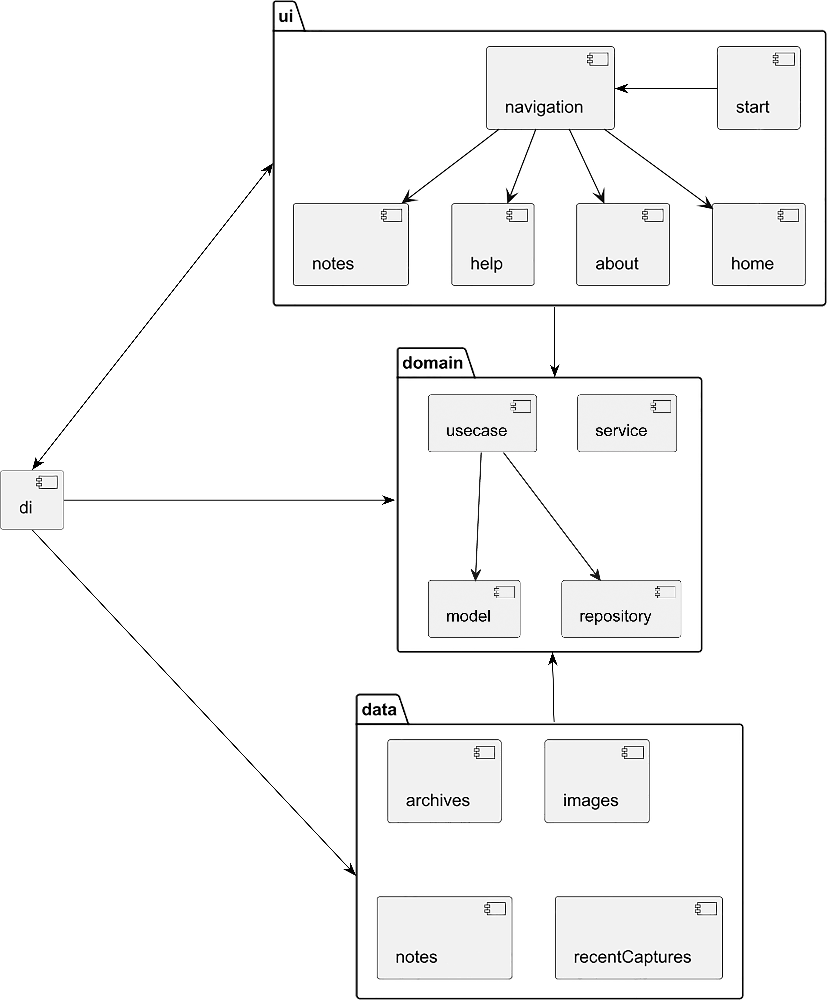
</div>

### Tools and testing

This projects uses Gradle as a build system.
Unit tests are implemented based on JUnit 5 and Mockito.
Unit tests for data layer classes utilize Robolectric with JUnit 4.

<h2 style="color: #16385E;">5) Can I contribute?</h2>

Contributions to this project are very welcome.

The current version of this project was created according to user-centred design principles. Not all of the requirements collected have been implemented yet. Open requirements for further development can be found in the GitHub Project for this repository and are open for further development.

You are also welcome to submit your own suggestions and code improvements.

<h2 style="color: #16385E;">6) License</h2>

cPast is marked with the MIT License.

This project is a revised version of [Capturing The Past](https://github.com/benskitchen/CapturingThePast).
The original application was developed at the [Sussex Digital Humanities Lab](https://www.sussex.ac.uk/research/centres/sussex-humanities-lab/)
in the Capturing the Past [project](https://blogs.sussex.ac.uk/capturing-the-past/about-us/).
The MIT licence is granted with the kind permission of PI Tim Hitchcock.